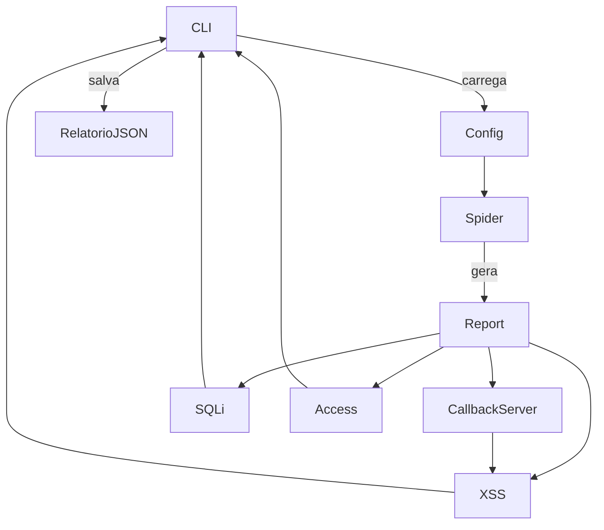

# Arquitetura e fluxo de dados

Esta seção descreve como os componentes do OWASP Web Scanner interagem, quais dados são compartilhados entre as etapas e quais dependências externas participam da execução.

## Visão em alto nível

1. **Interface de linha de comando (`owasp_scanner.cli`)**
   - Orquestra todas as fases (reconhecimento, callback server, SQLi, XSS e análise de acesso).
   - Usa `argparse` para ler os parâmetros: URL alvo, porta do callback e caminho do relatório.

2. **Configuração e utilidades centrais (`owasp_scanner.core`)**
   - `ScannerConfig`: agrega opções de execução (URL, relatório, cookies, credenciais, modo headless).
   - `load_configuration`: aplica normalização de URL, carrega variáveis do ambiente e do `.env` via `python-dotenv`.
   - `ReconReport`: estrutura compartilhada que armazena resultados do crawler (URLs, formulários, cookies) e é persistida em JSON.
   - `models.FieldInfo` / `models.FieldAttributes`: dicionários tipados que padronizam como campos de formulário são descritos (identificador + metadados estáveis).
   - `verify_dependencies`: confirma se `sqlmap` e `ffuf` estão disponíveis no `PATH` antes de iniciar o pipeline.

3. **Reconhecimento (`owasp_scanner.recon`)**
    - `Spider`: utiliza Playwright (Chromium headless) para navegar no alvo, extrair links, formularios e cookies.
       - Enfileira URLs do mesmo domínio, identifica alvos com query string para SQLi e serializa cada campo de formulário como `FieldInfo` (com atributos como `id`, `placeholder`, `aria-label`, `tag`).
       - Faz deduplicação por identificador e preserva metadados para que os scanners consigam localizar inputs mesmo quando IDs dinâmicos mudam.
       - Caso existam credenciais ou cookie de sessão, autentica a navegação automaticamente.
    - `run_ffuf`: executa `ffuf` com a wordlist `resources/common_dirs.txt` e adiciona rotas potencialmente sensíveis à lista de verificação de acesso.

4. **Servidor de callback (`owasp_scanner.callback.server`)**
   - Instancia um `TCPServer` simples para receber callbacks de payloads XSS.
   - `PayloadTracker` registra payloads injetados e callbacks recebidos, permitindo correlacionar execuções bem-sucedidas.

5. **Scanners de SQL Injection e XSS (`owasp_scanner.scanners`)**
   - SQLi: para cada URL com parâmetros, roda `sqlmap` em modo batch e identifica indícios de vulnerabilidade no stdout.
   - XSS: utiliza Playwright para testes de eco e injeta payloads com rastreamento pelo servidor de callback.
   - XSSStrike (opcional): consome os mesmos formulários estruturados (`FieldInfo`) para rodar fuzzing adicional via ferramenta `xssstrike`, ampliando a cobertura de payloads automatizados.

6. **Analisador de controle de acesso (`owasp_scanner.access.analyzer`)**
   - Reaproveita os cookies coletados para testar, em paralelo, se URLs supostamente restritas estão acessíveis.

## Fluxo de execução simplificado

## Dados compartilhados

| Dados                         | Origem                   | Consumidores                              |
|-------------------------------|--------------------------|-------------------------------------------|
| `ReconReport.sqli_targets`    | Crawler (links com `?=`) | Scanner SQL (`run_sql_scanner`)           |
| `ReconReport.xss_forms`       | Crawler (formulários `FieldInfo`) | Scanner XSS (`XSSScanner`) – usa metadados para construir seletores confiáveis |
| `ReconReport.access_targets`  | `ffuf` / wordlist        | Analisador de acesso (`run_access_analyzer`) |
| `ReconReport.cookies`         | Login/crawler            | XSS, análise de acesso, futuras etapas    |

## Dependências externas

- **sqlmap**: executado via `subprocess`, com timeout padrão de 300 segundos por alvo.
- **ffuf**: chamado via `subprocess` para enumerar diretórios; resultados são processados em JSON.
- **Playwright**: automatiza um navegador Chromium; exige download prévio dos binários com `playwright install`.

## Resiliência e tratamento de erros

- Falhas na autenticação ou navegação resultam em tentativa automática de login demo.
- Timeouts de Playwright, sqlmap ou ffuf são capturados e reportados sem interromper o fluxo geral.
- O servidor de callback roda em thread daemon e é finalizado com segurança ao final do pipeline.

## Extensibilidade

- Novos scanners podem consumir o mesmo `ReconReport`, adicionando campos específicos sem quebrar compatibilidade.
- A wordlist de diretórios (`resources/common_dirs.txt`) pode ser trocada por um arquivo customizado via parâmetro em `run_ffuf`.
- A CLI utiliza funções puras (por exemplo, `run_sql_scanner`, `run_xss_scanner`) que podem ser encadeadas em outros orquestradores ou pipelines CI/CD.
